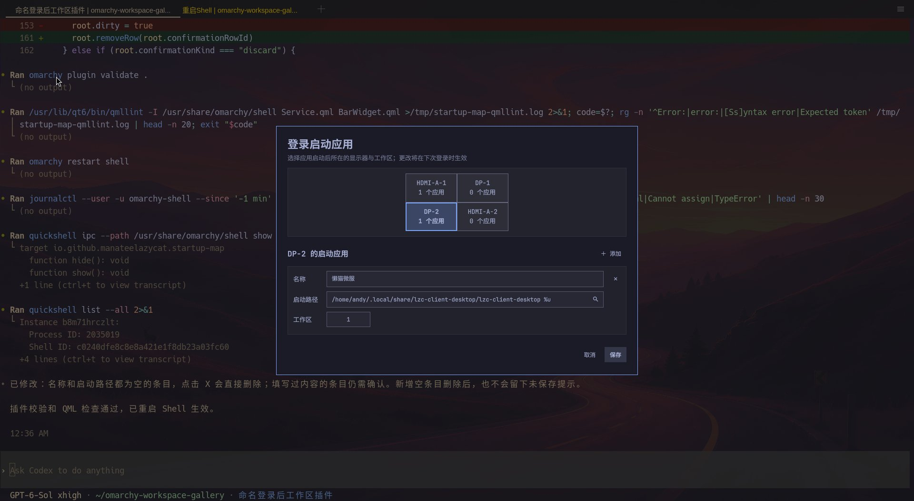
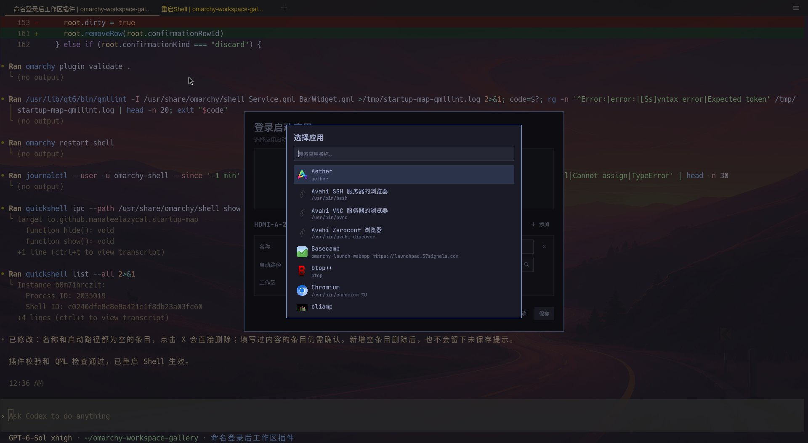

# Omarchy Startup Map

简体中文 | [English](README.md)





登录后，按显示器为应用指定工作区位置。每台显示器的工作区位置都从 1 开始；同一显示器上填写相同位置的应用会进入同一个工作区。界面中的位置不是 Hyprland 的全局工作区 ID，也不是应用启动顺序。

## 安装

本地项目：

```bash
./install.sh
```

也可从 GitHub 安装：`omarchy plugin add https://github.com/manateelazycat/omarchy-startup-map --enable --yes`。插件清单默认放在任务栏右侧。

## 使用

点击任务栏右侧的启动图标。对话框在当前聚焦窗口的中心打开；多显示器时，先在按物理位置排列的示意图里选择一台显示器。点击“添加”创建一项，依次填写名称、启动路径和“工作区”位置。启动路径可以是可执行文件绝对路径，也可以是 `.desktop` 文件里的 `Exec` 命令。点击启动路径输入框内的搜索图标，可以筛选已安装应用，选中后自动填写名称和 `Exec`。删除已填写的条目需要确认，空条目可直接删除。

点击“保存”后，配置写入 `~/.config/omarchy/startup-map.json`，**下次登录**生效。安装或重启 Omarchy Shell 不会重复启动应用。配置的显示器暂时未连接时，其应用会被跳过。

Omarchy Shell IPC 也可打开对话框：

```bash
omarchy-shell io.github.manateelazycat.startup-map show
```

卸载：`omarchy plugin remove io.github.manateelazycat.startup-map --yes`。

## 启动与放置

插件读取当前显示器、已有工作区和工作区规则，将每台显示器的 1、2、3… 映射成互不冲突的 Hyprland ID，再通过 Hyprland 启动规则把应用放到指定位置。桌面应用搜索结果使用 `gtk-launch` 启动，保持 `.desktop` 文件的启动语义；手动输入的 `Exec` 命令会移除没有文件参数时不适用的 `%f`、`%u` 等占位符。

某些应用会复用已运行的进程或通过独立服务创建窗口。这类窗口可能不会携带本次启动的进程标记，Hyprland 的进程启动规则也可能无法匹配；插件不会猜测并移动无关窗口。要让特定应用可靠重建其窗口，请填写能直接打开该窗口的专用命令。

## 开发检查

```bash
python3 -m unittest discover -s tests -v
omarchy plugin validate .
/usr/lib/qt6/bin/qmllint -I /usr/share/omarchy/shell Service.qml BarWidget.qml
python3 startup_map.py dry-run
```

## 协议

GPL-3.0-only。显示器示意图的坐标计算改编自 [Omarchy Display Reset](https://github.com/manateelazycat/omarchy-display-reset)。
